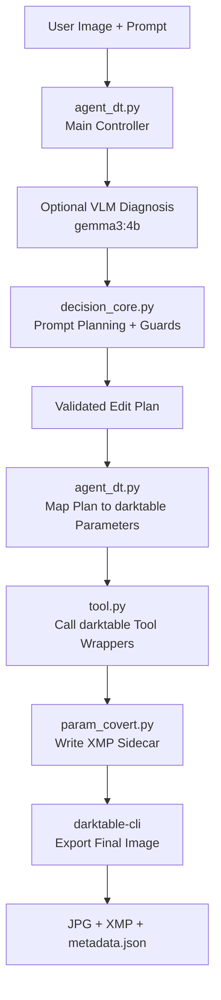

# PhotoAgent DT 使用說明

這份文件說明目前 Darktable 版本修圖 agent 的執行方式，以及 `agent_dt.py`、`decision_core.py`、`tool.py`、`param_covert.py` 四個檔案之間的分工。

## 1. 安裝與執行

### 1.1 需要先安裝的工具

請先確認電腦已安裝：

- Python
- darktable
- Ollama

如果要使用目前預設的模型，請在 terminal 執行：

```powershell
ollama pull qwen2.5:7b
ollama pull gemma3:4b
```

目前預設用途如下：

| Model | 用途 |
|---|---|
| `qwen2.5:7b` | Planner / Agent decision model，負責理解使用者 prompt 並產生修圖計畫 |
| `gemma3:4b` | VLM diagnosis model，負責輔助判斷圖片曝光、色偏、對比、飽和度等狀態 |

如果不使用 VLM，也可以在執行時選擇 `n`。

### 1.2 基本執行方式

請先進入當前程式碼所在的資料夾

接著執行：

```powershell
python agent_dt.py
```

如果圖片放在同一個資料夾，可以直接輸入檔名，例如：

```text
sample1.jpg
```

如果不想輸入完整副檔名，也可以輸入：

```text
sample1
```

程式會自動嘗試補成常見圖片副檔名，例如 `.jpg`。

### 1.3 Terminal 欄位說明

執行後會看到：

```text
Image path [input.jpg]:
Output path [output.jpg]:
darktable-cli [C:\Program Files\darktable\bin\darktable-cli.exe]:
darktable-cli timeout seconds [180]:
Use VLM diagnosis? [y/N]:
VLM model [gemma3:4b]:
VLM timeout seconds [120]:
VLM image max side [384]:
Edit request [Restore this photo to a natural, clean, professional look.]:
```

各欄位意義如下：

| 欄位 | 說明 |
|---|---|
| `Image path [input.jpg]` | 輸入要修圖的照片。直接按 Enter 會使用 `input.jpg` |
| `Output path [output.jpg]` | 輸出照片名稱。可輸入 `result`，程式會自動補成 `result.jpg` |
| `darktable-cli [...]` | darktable CLI 位置。若 darktable 安裝在預設路徑，直接按 Enter |
| `darktable-cli timeout seconds [180]` | darktable 匯出等待時間。通常直接按 Enter |
| `Use VLM diagnosis? [y/N]` | 是否使用 VLM 做圖片診斷。輸入 `y` 使用，直接 Enter 則不使用 |
| `VLM model [gemma3:4b]` | VLM 模型名稱。使用預設模型直接按 Enter |
| `VLM timeout seconds [120]` | VLM 最長等待時間。通常直接按 Enter |
| `VLM image max side [384]` | 給 VLM 判斷時的圖片縮放大小。通常直接按 Enter |
| `Edit request [...]` | 輸入修圖需求，例如 `make it brighter` 或 `restore natural exposure` |

### 1.4 Prompt 範例

一般單一修圖指令：

```text
make it brighter
```

```text
make this picture cooler
```

```text
make it more vivid
```

```text
make it sharper
```

資料集還原測試指令：

```text
Restore natural exposure, clean black levels, and moderate contrast. Slightly darken the image, increase contrast, lower the lifted black level, and correct the gamma-like midtone shift.
```

```text
Correct the cool blue color cast and restore a natural professional white balance. Make the image warmer, but do not increase saturation. Keep color intensity natural and believable.
```

```text
Restore this poorly graded photo to a natural, clean, professional tone. Normalize exposure, restore contrast, correct the gamma-like midtone shift, slightly reduce saturation, neutralize shadow and highlight color casts, and reduce vignette if present.
```

### 1.5 連續修圖

每次修圖完成後，程式不會立刻結束，而是會繼續等待下一個 prompt。

如果連續輸入：

```text
brighter
brighter
brighter
```

agent 會接續上一輪輸出的圖片繼續修圖，而不是每次都回到原圖。

輸出會類似：

- 第一輪：`output.jpg`
- 第二輪：`output_02.jpg`
- 第三輪：`output_03.jpg`

若要結束，輸入：

```text
exit
```

或：

```text
quit
```

### 1.6 輸出檔案

每次修圖完成後，程式會輸出三種檔案：一張修好的圖片、一個 darktable XMP sidecar，以及一個 agent metadata JSON。

假設輸出名稱使用預設的 `output.jpg`，第一輪會產生：

| 檔案 | 作用 | 主要用途 |
|---|---|---|
| `output.jpg` | 修圖後的照片 | 給使用者直接觀看與比較 |
| `output.jpg.xmp` | darktable sidecar | 記錄 darktable 實際套用的模組與參數 |
| `output.jpg.metadata.json` | agent metadata | 記錄 prompt、VLM 診斷、工具調用、參數轉換、警告訊息 |

如果是連續修圖，後續輸出會自動加上編號：

| 輪次 | 輸出照片 | XMP | Metadata |
|---|---|---|---|
| 第一輪 | `output.jpg` | `output.jpg.xmp` | `output.jpg.metadata.json` |
| 第二輪 | `output_02.jpg` | `output_02.jpg.xmp` | `output_02.jpg.metadata.json` |
| 第三輪 | `output_03.jpg` | `output_03.jpg.xmp` | `output_03.jpg.metadata.json` |

三個檔案的差別：

- `JPG` 是最後真的看到的修圖結果。
- `XMP` 是 darktable 可讀的修圖紀錄，能用來追蹤本次實際套用了哪些 darktable 模組。
- `metadata.json` 是 agent 的決策紀錄，適合用來檢查 prompt 是否被正確理解、VLM 是否判斷合理、工具參數是否符合預期。

簡單來說，`output.jpg` 用來看結果，`output.jpg.xmp` 用來追蹤 darktable 參數，`output.jpg.metadata.json` 用來分析 agent 決策。

## 2. 四個主要檔案

### 2.1 `agent_dt.py`

`agent_dt.py` 是主要入口，負責把整個流程串起來。

主要工作：

- 讀取使用者輸入的圖片、輸出路徑與 prompt
- 決定是否呼叫 VLM 做圖片診斷
- 呼叫 `decision_core.py` 產生修圖計畫
- 把抽象修圖操作轉成 darktable 工具參數
- 產生 `.xmp` 與 `.metadata.json`
- 呼叫 `darktable-cli` 匯出最終圖片
- 在 interactive mode 中支援連續輸入 prompt

可以把它理解成整個 Darktable agent 的主控程式。

### 2.2 `decision_core.py`

`decision_core.py` 是決策核心，負責理解 prompt 並決定要做哪些修圖。

主要工作：

- 解析使用者 prompt
- 整合 VLM diagnosis 與 local image statistics
- 產生 edit plan
- 驗證 plan 是否合理
- 移除 no-op 或不合理工具
- 對單一明確指令做 scaling，例如 `brighter`、`cooler`、`more vivid`
- 在 Ollama 或 VLM 失敗時提供 deterministic fallback

可以把它理解成 agent 的大腦。

### 2.3 `tool.py`

`tool.py` 是 darktable 工具層，負責定義 agent 可以呼叫的修圖工具。

目前主要支援：

- `adjust_exposure`
- `adjust_local_contrast`
- `adjust_shadows_highlights`
- `adjust_color_balance_rgb`
- `adjust_temperature`
- `adjust_rgb_levels`
- `adjust_color_zones`
- `adjust_vignette`
- `apply_xmp_and_export`

可以把它理解成 agent 的工具箱。

### 2.4 `param_covert.py`

`param_covert.py` 負責把 Python 內部參數轉成 darktable XMP 需要的格式。

主要工作：

- 將修圖參數編碼成 darktable 可讀的 XMP 格式
- 寫出 darktable sidecar `.xmp`
- 檢查 XMP 內容是否與本次執行的 tool layers 一致

可以把它理解成 Python agent 與 darktable XMP 之間的轉換器。

## 3. Overall Workflow



## 4. 簡短總結

目前 Darktable 版本的 agent 流程是：

`agent_dt.py` 負責主流程，`decision_core.py` 負責決策，`tool.py` 負責可呼叫工具，`param_covert.py` 負責 darktable XMP 參數轉換。

這樣的結構可以讓我們在不破壞原本程式碼的前提下，逐步增加更多 darktable 修圖工具，並用 XMP 與 metadata 追蹤每次 agent 的修圖行為。
