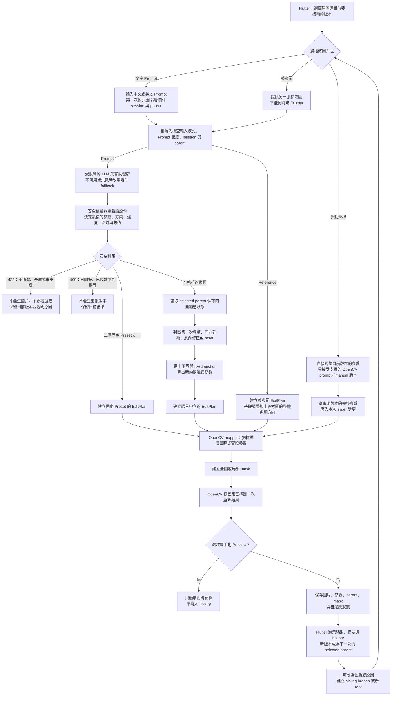

# 現階段 AI 修圖系統流程：白話完整版

這份文件用「系統每一段在做什麼」來解釋目前成果，不拆函式、不講逐行程式碼。

## 先說清楚目前真正上線的範圍

- 正式互動修圖引擎是 **OpenCV**，重點是快速、小幅、可控的後續微調。
- 中文與英文 prompt 都會進入同一套修圖流程；英文支援不是另外做一套控制器。
- Darktable 目前暫停，沒有放進正式互動主流程。
- 組員研究中的強化學習、非監督式學習與 PhotoAgent 等「自動把照片變好看」模型，目前也還沒有接進正式 App 流程。它們是未來可放在前一階段的第一版修圖，不應被描述成現在已上線。

第一次出現的四個名詞，可以先這樣理解：

- **EditPlan**：後端整理好的「標準化修圖清單」，例如「全圖增加一點亮度、降低一點飽和度」。
- **parent**：目前選定、準備接著修改的上一個版本。
- **anchor**：這一段連續微調固定使用的重算起點。
- **mask**：像模板一樣，規定只有指定區域可以被修改的遮罩。

## 一張圖看完整流程

## 1. Flutter 送給後端的是什麼

使用者先選原圖，再選擇三種工作方式之一：

1. **Prompt 修圖**：輸入中文或英文文字。
2. **參考圖修圖**：再選一張圖片，讓系統參考整體色調方向。
3. **手動調整**：直接拉曝光、亮度、對比等滑桿。

Prompt 和參考圖是互斥模式，不能同一個請求同時送兩種要求。第一次 prompt 修圖會附上原圖；後續修圖通常只需要送出 session 與 parent，告訴後端「接著哪一版改」。

## 2. Prompt 怎麼變成修圖參數

後端先確認圖片、prompt／參考圖模式、session 與 parent 關係都合法，再處理文字。

如果 LLM 已啟用，它會先嘗試把自然語句整理成初步修圖意圖；LLM 關閉、逾時、回傳壞資料或判斷錯誤時，系統會改用規則 fallback。不過 **LLM 不是最後裁判**。

接著安全編譯器一定會重新檢查使用者原句，決定：

- 要調哪個參數。
- 增加還是降低。
- 稍微、正常或較強。
- 全圖還是指定區域。
- 是否為明確數值、reset 或多參數 compound。

最後產生語言中立的 EditPlan。中文「亮一點」和英文 `make it brighter` 若意思相同，進入這一步後就會變成同一種標準操作，後續控制器、OpenCV 與 history 不再區分語言。

這也是為什麼 LLM 就算回錯軸、錯方向或多加操作，仍不能直接控制最終修圖。

## 3. 為什麼「太亮了」知道要反向調整

每一筆成功版本都保存它自己的自適應狀態。當使用者從某一版繼續輸入「太亮了」或 `it is too bright`，系統會讀取那一版的 parent 狀態，知道上一段正在調亮度，也知道先前往哪個方向調。

控制器會把這種語句判斷成反向修正，並在目前已知的上、下界中選一個較小的新步長。使用者再反向幾次時，範圍會逐步縮小，讓調整收斂，不會一直用第一次的大步長來回跳。

若使用者說「這樣剛好」或 `just right`，系統回 409，保留目前版本，不再做一張完全相同的圖片。

## 4. 為什麼連續微調不會一直疊壞像素

parent 提供的是「目前從哪一版接著談」的上下文，但同一段相容的自適應微調不會每次都把新效果疊在上一張輸出像素上。

系統會保存一張 fixed anchor，也就是這段調整的固定起點；每次先算出新的「總參數」，再從同一 anchor 重算一次結果。這可避免多次 JPEG／像素運算逐步累積誤差。

若使用者開始完全不同的調整段落，系統才會把目前可見的 parent 結果當成新的 anchor。

## 5. 系統怎麼只改天空、人物或背景

局部修圖會先做 mask：

- **天空、人物、背景**：由 SegFormer 語意模型從 session 原圖辨識。
- **背景**：第一版定義為人物 mask 的反相。
- **亮部、暗部**：依 session 原圖的亮度建立 mask。
- **中心、邊緣**：依圖片尺寸建立幾何 mask。

mask 固定參考 session 原圖，所以連續調色後不會因顏色已改變而讓區域邊界漂移；真正套用調色時，則從該分支的 fixed anchor 重算。

如果照片中找不到可靠人物，人物與背景都會回 422 `semantic_target_not_found`。系統不會偷偷改成全圖，避免使用者指定「人物」卻誤改整張照片。

## 6. EditPlan、OpenCV 與 history 各自做什麼

EditPlan 只描述「想做什麼」，OpenCV mapper 再把它翻成引擎實際需要的曝光、亮度、對比、飽和度、色溫等數值。

OpenCV 取得：

- 固定基準圖。
- 實際參數。
- 全圖或局部 mask。

然後一次產生結果圖。成功後，後端才保存結果、參數、parent 關係、EditPlan、mask 資訊與自適應 snapshot，並在 history 新增一筆不可變版本。

Prompt／reference 主流程若在 render、結果驗證或 history 保存前失敗，不會把半成品當成成功版本；409／422 也不會新增 history。

Flutter 收到成功結果後會顯示圖片與摘要，並自動把新版本選為下一次的 parent。409 或 422 只顯示狀態／錯誤，不會替換目前圖片或選中的版本。

## 7. 歷史版本與分支怎麼運作

history 不是只留「最新一張」，而是每一版都記錄自己的 parent。

- 從最新版繼續：形成一般線性歷史。
- 選回舊版再修改：新版本以那個舊版為 parent，形成 sibling branch。
- 選回原圖再修改：建立 parent 為空的新 root。

自適應狀態也跟著每一筆版本保存，不是整個 session 共用一份可變狀態。因此兩個 sibling branch 不會互相拿到對方最新的調整區間。

## 8. 手動滑桿和 Prompt 有什麼不同

Prompt 模式先理解自然語言，再決定參數；手動模式則由使用者直接指定參數。

打開手動調整時，系統會讀取來源版本的完整參數，再覆蓋這次動到的 slider，並從來源的同一基準圖重算：

- **Preview**：只是暫時顯示，不新增 history。
- **Commit／套用**：才建立一筆正式 manual 版本，parent 指向來源版本。

手動調整第一版只接受 OpenCV 的 prompt／manual 來源。Reference 版本不能直接進入 manual v1，前端與後端都會明確說明，不會猜測如何接手參數。

## 9. 參考圖修圖和 Prompt 有什麼不同

參考圖模式不解析文字，而是用另一張圖片提供第一版色調方向。現階段做法是 OpenCV 的基礎調整，再輕量參考另一張圖的整體平均色調。

它不是完整 style transfer：

- 不會複製參考圖的構圖或物件。
- 不會精準複製每個局部色彩。
- 不保證重現所有質感、光線與風格細節。

Prompt 與參考圖互斥，是為了讓第一版行為清楚；目前尚未支援「像參考圖，但再亮一點」這種同一請求混合模式。

## 10. 系統聽不懂或處理失敗時會怎麼做

系統採 fail-closed，也就是寧可要求澄清，也不猜錯方向：

- **422**：多義、矛盾、跨區域、超過三軸、只解析到一部分、非法數值、未知風格或未支援功能。
- **409**：已經剛好、已收斂、已到參數邊界，或無法再做有意義的小步調整。
- **找不到局部目標**：422，且不改成全圖。
- **內部失敗**：不新增成功 history，也不改動 parent 的既有狀態。

一個 compound prompt 只要有一段不安全，就整句停止，不會悄悄只套用看得懂的半句。

## 11. 現在支援與不支援的邊界

目前公開的 11 個參數是：

1. 曝光
2. 亮度
3. 對比
4. 亮部
5. 暗部
6. 飽和度
7. 色溫
8. 銳化
9. 清晰度
10. 去霧
11. 暗角

單句最多三個主要操作，且只能使用一個 region。百分比在不同參數沒有共同單位，因此目前拒絕，不自行猜換算方式。

英文 prompt 已支援自然 action、觀察式回饋、數值、reset、region、兩／三軸 compound 與多輪 parent-aware 修正；這不等於所有 Flutter UI 已英文化，也不承諾任意中英混合句。

目前純英文 preset 只有三組固定效果：

- `retro film style`、`vintage film look`、`old camera look` → `vintage_film`
- `cinematic style`、`cinematic look`、`movie look` → `cinematic`
- `fresh Japanese style`、`Japanese style`、`clean Japanese look` → `fresh_japanese`

Preset 目前沒有 style strength，也不支援「cinematic 但不要太暗」這類 modifier composition。否定、未知風格或含未支援 modifier 的句子會回 422，不會只套其中一半。

## 看完後應能直接回答的八個問題

1. **Prompt 怎麼變成修圖參數？**
   LLM／fallback 先做初步理解，安全編譯器重新判斷原句，再產生語言中立 EditPlan，最後由 mapper 翻成 OpenCV 參數。

2. **為什麼「太亮了」知道要反向？**
   因為 parent 保存上一段調整的軸、方向、候選值與上下界；控制器會在該分支內反向縮小步長。

3. **怎麼只調天空、人物或背景？**
   先從 session 原圖建立語意 mask，再只允許 mask 範圍內的像素被修改。

4. **為什麼連續微調不會反覆疊像素？**
   同一段調整每次都從 fixed anchor 用新的總參數重算，而不是把效果一直疊在上一張輸出上。

5. **歷史與分支怎麼保存？**
   每筆版本保存 parent；選舊版會建立 sibling，選原圖會建立新 root，而且每個分支各自保存自適應 snapshot。

6. **Prompt、手動、參考圖有何不同？**
   Prompt 由文字推導參數；手動由 slider 直接控制；參考圖只提供第一版整體色調方向。

7. **聽不懂、剛好或失敗時怎麼辦？**
   422 要求澄清，409 保留目前結果，內部失敗不新增成功 history；三者都不污染既有 parent。

8. **真正支援哪些引擎與 preset？**
   正式引擎是 OpenCV；Darktable 暫停，組員模型尚未接入。Preset 只有 `vintage_film`、`cinematic`、`fresh_japanese` 三組固定 allowlist。
