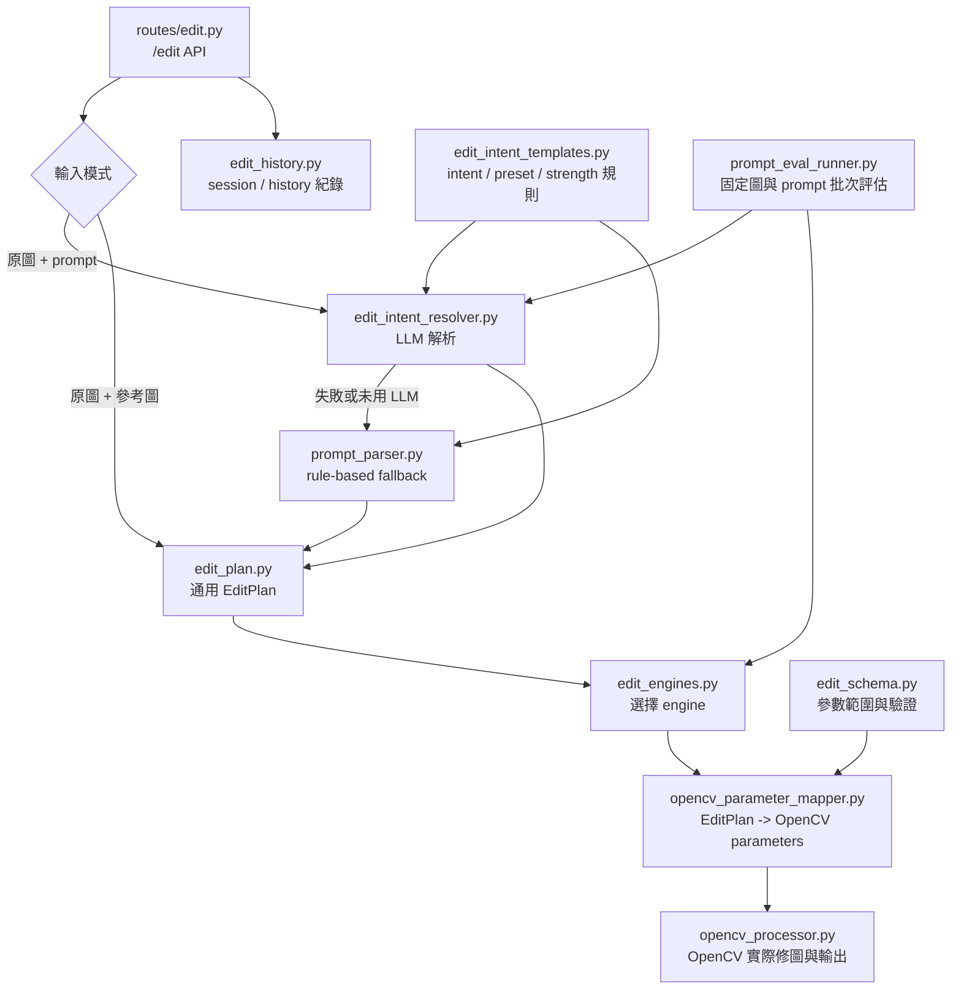

# AI Photo Editor

目前先做到前後端基本流程有通。

現在有的功能：
- frontend 可以選原圖
- frontend 可以選參考圖
- backend 可以收兩張圖
- backend 會存圖
- backend 會產生一張陽春的 result
- 可以用網址直接看 result 圖

專案結構：

- `frontend/` Flutter 前端
- `backend/` FastAPI 後端
- `backend/storage/uploads/` 上傳圖片
- `backend/storage/results/` 結果圖片

---

要跑 frontend

1. 先確定有安裝 Flutter
2. 進到 `frontend/`
3. 安裝套件
   - `flutter pub get`
   - `flutter pub add image_picker`
4. 跑前端
   - web：`flutter run -d chrome` (我測試都先用這個)
   - android：`flutter run -d <device_id>`

frontend 目前功能：
- 選原始圖片
- 選參考圖片
- 按開始修圖
- 目前還沒跟後端接起來，就是先跑 mock 流程

frontend 目前主要檔案：
- `frontend/lib/main.dart`

補充：
- 圖片顯示的樣子有點醜但我先不管，先以功能可用為主，版面之後再調

---

要跑 backend

1. 進到 `backend/`
2. 開啟虛擬環境
   - `python -m venv .venv`
   - `.venv\Scripts\Activate`
3. 安裝套件
   - `pip install -r requirements.txt`
4. 啟動 server
   - `uvicorn app.main:app --reload`

啟動後可以開這幾個網址確認：
- `http://127.0.0.1:8000/`
- `http://127.0.0.1:8000/health`
- `http://127.0.0.1:8000/docs`

---

backend 目前 API

`GET /`
- 確認後端有啟動

`GET /health`
- 健康檢查

`POST /edit`
- 上傳兩張圖

`POST /edit` 要用的欄位名稱：
- `original_image`
- `reference_image`

可以直接去 Swagger 測：
1. 打開 `http://127.0.0.1:8000/docs`
2. 找 `POST /edit`
3. 按 `Try it out`
4. 上傳原圖和參考圖
5. 按 `Execute`

---

Edit 成功之後

- 產生一個 `task_id`
- 把圖存到 `storage/uploads/<task_id>/`
- 產生結果圖到 `storage/results/<task_id>/result.png`
- 回傳 `result_url`

backend 目前主要檔案：
- `app/main.py`：FastAPI 入口、CORS、static files
- `app/routes/health.py`：health API
- `app/routes/edit.py`：收圖 API
- `app/services/image_processor.py`：mock 處理 (之後會換成AI模型)

---

直接看結果圖

`POST /edit` 成功後，回傳會有 `result_url`

例如：
- `http://127.0.0.1:8000/storage/results/<task_id>/result.png`

直接貼到瀏覽器就能看

---

目前已知狀況

- Windows / OneDrive / Flutter desktop 容易有 `.plugin_symlinks` 問題
- frontend 現在建議先跑 `chrome` 或 Android，不要碰 windows desktop
- VS Code 如果跳 CMake 視窗，可以直接忽略

---

3/22更新

- 前端和後端已經連通，可以直接在前端的結果圖片那裡看到現在的mock result，也可以自己打開backend / storage裡面的資料夾確認
- 指令: 進 `frontend/` 裡面打 `flutter pub add http`
- 完整使用方法: 先在 `backend/` 開server: `uvicorn app.main:app --reload` (記得要先開進虛擬環境 `.venv\Scripts\Activate` 跟確認pip `pip install -r requirements.txt`)
- 然後在 `frontend/` 打 `flutter run -d chrome` 就可以測試功能了
- 目前圖片處理在 `backend/services/image_processor.py`，之後正式模型的圖片處理就改那邊

---

2026/5/25 更新

- 目前前端畫面大致跟原本差不多，但後端已經不是單純 mock result，可以用 prompt 做一些基本修圖。
- 測試方式一樣是先開 backend，再去 `frontend/` 跑 `flutter run -d chrome`。
- 現在可以選一張原圖，然後輸入像 `亮一點`、`太亮了，暗一點`、`色彩更鮮豔`、`亮一點但不要過曝` 這類文字，前端會顯示修圖後的結果。
- 也可以接著連續調整，例如先輸入 `亮一點`，結果出來後再輸入 `再自然一點`，後端會接著上一張結果繼續修。
- 下方會有簡單的修圖歷史，可以點某一次結果，後面新的 prompt 就會基於那張圖繼續修。
- 目前也有先做幾個比較常用的風格字，例如 `暗黃底片感`、`電影感`、`清新日系風格`。
- 如果要用參考圖模式，就放原圖 + 參考圖，不要同時填 prompt；如果要文字修圖，就放原圖 + prompt，不要放參考圖。

---

2026/5/27 services 流程簡圖

目前 `backend/app/services/` 可以先用這張圖理解：前半段負責理解需求並產生通用 `edit_plan`，後半段才由 engine 把 `edit_plan` 轉成實際修圖參數。

簡單分工：

- `edit_intent_resolver.py`：主要 LLM 入口，把文字 prompt 解析成通用修圖意圖。
- `prompt_parser.py`：LLM 沒開或解析失敗時的 rule-based fallback。
- `edit_plan.py`：engine-neutral 中間格式，之後 OpenCV / Darktable 都吃這層。
- `edit_engines.py`：engine 切換入口，目前只正式支援 `opencv`。
- `opencv_parameter_mapper.py`：把通用 `edit_plan` 翻成 OpenCV 參數。
- `opencv_processor.py`：真正用 OpenCV 套亮度、對比、飽和度、色溫、銳化等效果並寫出結果圖。
- `edit_history.py`：記錄 session、parent edit 與歷史版本。
- `edit_intent_templates.py`：放 intent、preset、strength 與 prompt 保護規則。
- `edit_schema.py`：限制和驗證修圖參數範圍。
- `prompt_eval_runner.py`：本機 eval 輔助工具，用固定圖片和 prompt 批次比較效果。
- `image_processor.py`：早期 mock result helper，目前不是主線 `/edit` 流程的核心。
