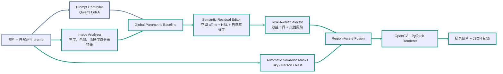

# ResidualFusion

ResidualFusion 是一套以 LLM 為互動核心的 Expert C 風格照片增強系統。它以 MIT-Adobe FiveK
Expert C 作為監督目標，讓微調後的 Qwen3 理解使用者意圖，再由影像模型依照片內容
決定實際修圖幅度，最後透過 OpenCV 與 PyTorch 快速產生可追蹤的修圖結果。

本資料夾是可獨立執行的完整發布包，包含 FastAPI backend、Flutter frontend、影像模型
權重、測試工具與評估紀錄。FiveK 訓練圖片、大型 LLM 權重、使用者照片與可重建快取
不放入 GitHub。

## 實作貢獻

1. **語言理解與像素決策分工。** Qwen3-1.7B BF16 LoRA 將口語 prompt 解析成修圖
   意圖；影像模型再依實際像素決定參數與區域強度，避免 LLM 只憑文字猜數值。
2. **從破壞修復走向內容相依的 Expert C 學習。** 早期以破壞性調色與 Oracle 驗證
   OpenCV 參數化修圖可行；正式影像模型則以原圖到 Expert C 參考圖的自然配對為主要監督。
3. **監督式殘差學習。** 模型保留快速全域修圖基線，再學習基線與 Expert C 之間仍
   缺少的空間色彩、HSL 選色與修圖強度，而非重新生成整張圖片。
4. **語意區域與風險控制。** SegFormer 區分天空、人物與其餘區域；安全選擇器抑制
   過修、色偏與 banding，兼顧可見改善與失敗尾端。
5. **完整系統與可重現紀錄。** 提供 CLI、API、Web UI、JSON session、模型 hash、
   凍結評估與套件完整性檢查。

## 系統流程



綠色外框與箭頭標示「只執行影像模型」會經過的路徑；藍灰色標示共用輸入與
Prompt Controller 支線。

LLM 不直接生成像素，也不單獨判斷照片哪裡曝光不足。它負責「使用者想怎麼修」；
影像分析與殘差模型負責「這張照片實際要修多少」。不需要 prompt 時，也可以只執行
影像模型做自動增強。

## 研究方法

### 1. 破壞性調色與 Oracle 監督

第一階段對 Expert C 圖片加入可控的破壞效果，再以已知參考圖離線搜尋目前工具可達到的
最佳參數。Oracle 標籤用於訓練期監督；正式推論只使用凍結權重，不取得 GT 或執行
Oracle 搜尋。

```text
破壞圖 + Expert C 參考圖 -> 搜尋最佳參數 -> Oracle 修復圖與參數標籤
```

這項實驗同時揭露只學人工破壞容易成為反向修復器，無法完整描述 Expert C 的內容相依
風格，因此後續改以完整自然配對作為主要學習來源。

### 2. Prompt Controller 的監督式 LoRA 微調

以 Qwen3-1.7B 為基底，使用 PyTorch、Hugging Face Transformers 與 PEFT 執行 BF16
LoRA 微調。模型輸出 `auto_enhance`、`fix_exposure`、`fix_white_balance`、
`restore_natural` 等結構化意圖，再交由影像管線執行。

選定 checkpoint 在固定 validation split 上的 intent accuracy 通過預設驗證門檻，完整
欄位 exact accuracy 為 **95%**。隔離合成 prompt 稽核的 intent accuracy 為 **97.5%**；
複合 constraints micro-F1 為 **74.03%**，多重限制泛化仍列為已知限制。

### 3. FiveK 成對監督與殘差學習

正式影像研究使用 5,000 組色彩管理後的 DNG 原圖 render 與 Expert C TIFF：

- 4,600 組用於主模型訓練。
- 200 組 development 用於凍結前選擇。
- 200 組 final 僅做一次最終評估。
- 訓練資料內採 5-fold out-of-fold 產生訓練期預測，避免以 in-fold 結果評估同一樣本。

全域基線先以 32 維影像統計特徵預測亮度、對比、gamma、飽和度、色溫、tint、
銳化與暗角。殘差模型再使用 MobileNetV3 Small 預測空間 RGB affine、六個 hue sector
的 HSL 控制與自適應強度。最後的區域強度 ensemble 在 final 開封後以全部 5,000 組
重新擬合供 Demo 使用；正式泛化結論仍只引用開封前的 final 評估。

## 量化成果

這不是分類任務，因此不能只用一個 accuracy 表示成效。影像模型主要觀察平均品質增益、
改善比例、最差 10%、harm rate 與 catastrophic rate。

| 模組 | 評估結果 | 意義 |
| --- | --- | --- |
| Global Parametric Baseline | sealed final 改善率 71.25%；mean composite +0.021971；PSNR +0.779 dB；SSIM +0.019975 | 快速、可解釋的全域基線成立 |
| Semantic Residual Editor | frozen development 對基線 strict win 90.0%；mean +0.004697 | 空間殘差與 HSL 多數優於只用全域參數 |
| Risk-Aware Selector | mean +0.032214；harm 21.0%；catastrophic 17.0% | 相較固定套用殘差模型的 25.5% / 21.0%，尾端風險下降 |
| 完整 ResidualFusion 影像管線 | final mean +0.030224；worst decile -0.041358；harm 15.0%；catastrophic 11.0%；edit rate 78.5% | 保留平均效益，同時降低明顯過修 |

以上凍結評估支持殘差學習與區域安全融合能改善既有全域基線，但不代表每張照片都會比
Expert C 更符合人類主觀偏好。

## 環境需求

- Windows 10/11、PowerShell 與 Python 3.12。
- NVIDIA GPU；本發布包以 RTX 4060 Laptop、CUDA 11.8 驗證。
- 完整自然語言模式另需 Ollama。
- Web UI 另需 Flutter SDK 3.44 與 Chrome。
- 第一次使用語意遮罩時需要下載 SegFormer；之後可離線執行。

本次驗證版本已固定於 `requirements.txt`。在本模組根目錄執行：

```powershell
python -m venv .\.venv
.\.venv\Scripts\python.exe -m pip install --upgrade pip
.\.venv\Scripts\python.exe -m pip install -r .\requirements.txt
.\.venv\Scripts\python.exe -c "import torch; print(torch.cuda.is_available())"
```

最後一行應輸出 `True`。若不是 CUDA 11.8，請依 PyTorch 官方指引改用相符 wheel。

`requirements.txt` 是可直接啟動發布包的 **runtime** 依賴；LoRA 已合併成 GGUF，因此
執行修圖不需要安裝 PEFT。需要重新微調時，才另外建立含 PEFT 與訓練工具的研究環境。

下載並快取語意分割模型：

```powershell
.\.venv\Scripts\python.exe -c "from transformers import AutoImageProcessor, SegformerForSemanticSegmentation; m='nvidia/segformer-b5-finetuned-ade-640-640'; AutoImageProcessor.from_pretrained(m); SegformerForSemanticSegmentation.from_pretrained(m)"
```

## Prompt 模型資產

ResidualFusion 執行期只有一個 LLM：以 **Qwen3-1.7B** 微調的 Prompt Controller。
SegFormer 負責影像語意分割，不屬於語言模型。

微調成果已保留為兩種形式：

- LoRA adapter：便於後續研究與再微調。
- 合併後的 BF16 GGUF：供 Ollama 直接推論，約 3.45 GB。

發布包已包含完整的安裝契約：

| 檔案 | 用途 |
| --- | --- |
| `requirements.txt` | 經實機驗證的精確 Python runtime 版本 |
| `models/MODEL_ASSETS.json` | GGUF、LoRA 與 adapter config 的檔名、大小及 SHA-256 |
| `models/Modelfile.prompt-control` | Ollama 推論參數範本 |
| `models/huggingface/README.md` | Hugging Face Prompt Controller Model Card |
| `install_prompt_model.ps1` | 從本機或 Hugging Face 下載、驗證並匯入 Ollama |

大型模型資產與原始碼分開發布。微調後的 GGUF、LoRA adapter 與設定檔已發布於
[Kaiii1912/residual_fusion](https://huggingface.co/Kaiii1912/residual_fusion)，並由
`models/MODEL_ASSETS.json` 記錄檔名、大小與 SHA-256。安裝腳本會從 Hugging Face
下載 GGUF、驗證完整性，再匯入 Ollama；預設鎖定已驗證的 `v1.0.0` revision，避免
後續更新影響重現結果。

本機已有 GGUF 時：

```powershell
.\install_prompt_model.ps1 `
  -GgufPath "C:\path\ai-photo-prompt-control-exp007-bf16.gguf"
```

從 Hugging Face 安裝已驗證的 `v1.0.0`：

```powershell
.\install_prompt_model.ps1 `
  -RepoId "Kaiii1912/residual_fusion"
```

需要測試未來 revision 時，可另外傳入 `-Revision`；正式重現建議保留預設值。

驗證 Ollama 模型：

```powershell
.\install_prompt_model.ps1 -CheckOnly
```

模型資產的發布與下載依據可參考
[Ollama 匯入 GGUF](https://docs.ollama.com/import)與
[Hugging Face CLI](https://huggingface.co/docs/huggingface_hub/en/guides/cli)。

## 快速操作

### 只執行影像模型

使用完整的殘差與區域安全影像管線，但不啟動 Prompt Controller、backend、frontend
或 Ollama。

```powershell
.\run_residual_fusion.ps1 -InputPath "C:\path\photo.jpg"
```

資料夾批次處理：

```powershell
.\run_residual_fusion.ps1 -InputPath "C:\path\photos" -Recursive
```

指定輸出或覆蓋：

```powershell
.\run_residual_fusion.ps1 `
  -InputPath "C:\path\photo.jpg" `
  -OutputDir ".\outputs\my_test"

.\run_residual_fusion.ps1 `
  -InputPath "C:\path\photo.jpg" `
  -OutputDir ".\outputs\my_test" `
  -Overwrite
```

預設輸出為 `outputs/<檔名>/` 下的 PNG、逐圖 JSON 與 `batch_summary.json`；同名資料夾
存在時會自動建立 `(1)`、`(2)`，保留先前結果。

### 完整 LLM + backend + frontend

開啟兩個 PowerShell 終端。

Terminal 1：

```powershell
.\start_backend.ps1 -CheckOnly
.\start_backend.ps1
```

Terminal 2：

```powershell
.\start_frontend.ps1
```

後端文件位於 `http://127.0.0.1:8000/docs`。停止服務時在各 Terminal 按 `Ctrl+C`。
結果圖片與 session 分別存於 `backend/storage/results/` 與 `backend/storage/sessions/`。

### 產生 2 至 4 張比較圖

```powershell
.\make_comparison.ps1 `
  -Images "C:\path\original.jpg", ".\outputs\photo\photo.png", "C:\path\expert-c.jpg" `
  -Labels "原圖", "ResidualFusion", "Expert C"
```

支援 JPG、PNG 與 WebP，預設輸出至 `comparisons/`。

## 套件結構

```text
backend/                 FastAPI、LLM 路由、影像分析、遮罩與修圖 runtime
frontend/                Flutter Web 操作介面
training/                模型契約、推論權重、renderer 與凍結評估紀錄
models/                  Prompt Controller 資產契約與 Ollama Modelfile
tools/verify_package.py  發布包完整性與 SHA-256 檢查
run_residual_fusion.ps1  無 prompt 的影像模型入口
start_backend.ps1        完整 backend 入口
start_frontend.ps1       Flutter frontend 入口
install_prompt_model.ps1 GGUF 下載、驗證與 Ollama 匯入
make_comparison.ps1      2 至 4 張圖片比較工具
```

## 評估與稽核紀錄

以下機器可讀紀錄用於追溯資料切分、模型選擇、量化結果與檔案完整性：

- `training/baselines/*.json`：資料切分、模型契約、訓練設定與主要指標。
- `training/outputs/**/result.json`：凍結 development/final 結果、安全門與 5,000 組
  post-final fit 稽核。
- `PACKAGE_MANIFEST.json`：發布檔案清單、精確大小與 SHA-256，可檢查權重是否損壞或漏傳。

發布前的乾淨套件檢查：

```powershell
python .\tools\verify_package.py --strict-clean
```

完成環境與模型安裝後的 runtime 自我檢查：

```powershell
.\start_backend.ps1 -CheckOnly
```

## 限制與科學界線

- Expert C 是監督目標，不是客觀且唯一的「好看」標準。
- 完整 5,000 組 post-final fit 沒有新的 untouched test；正式泛化證據來自預先凍結的
  200 張 final。
- 影像模型主要學習攝影照片；插畫、遊戲截圖與極端濾鏡屬 OOD，不保證相同效果。
- Prompt Controller 對主要意圖穩定，但多條複合限制仍未通過完整外部泛化驗證。
- 本系統做參數化與區域色調調整，不執行生成式補圖、真正去模糊或物件內容重建。

## 資料與授權

本模組不散布 MIT-Adobe FiveK 圖片；資料集、預訓練模型及第三方套件依其原始授權與
使用條款提供。

研究基礎：[MIT-Adobe FiveK](https://people.csail.mit.edu/vladb/photoadjust/)、
[Qwen3](https://huggingface.co/Qwen/Qwen3-1.7B)、
[SegFormer](https://github.com/NVlabs/SegFormer)。
